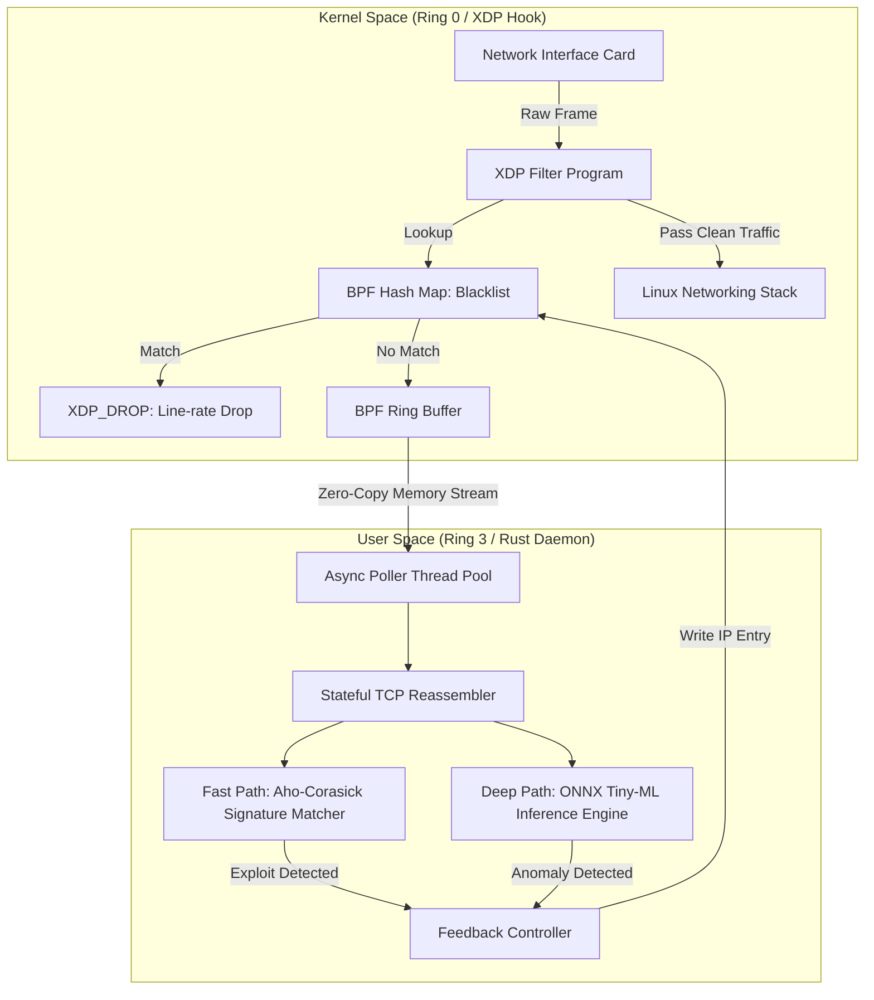
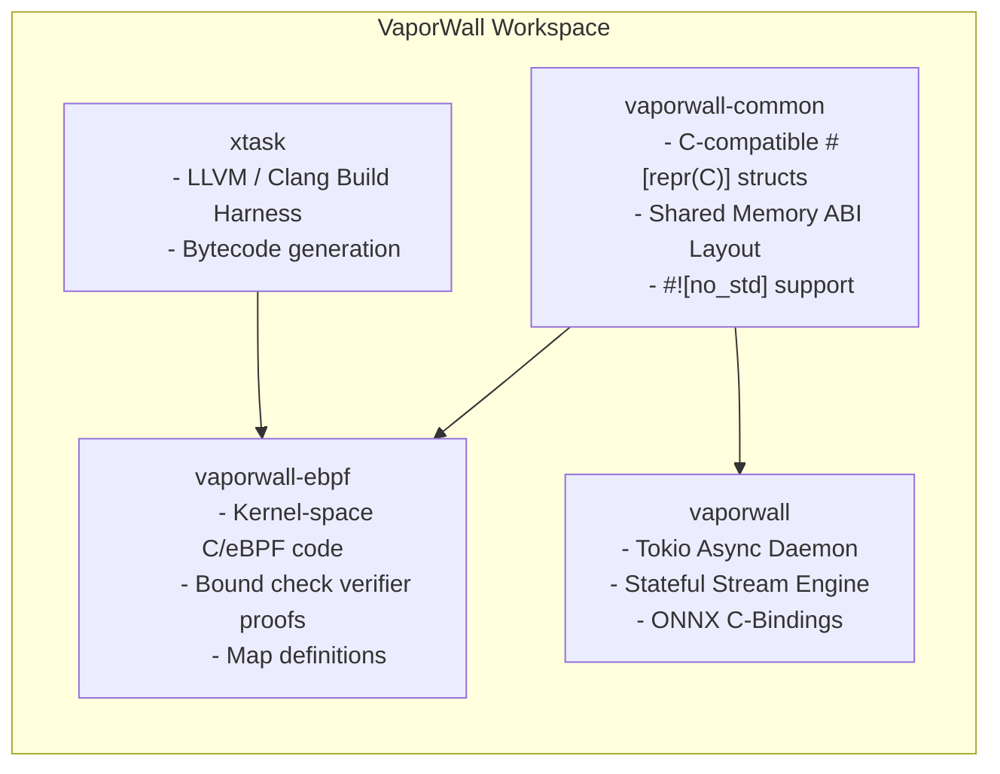

<div align="center">

# VaporWall

**High-Performance eBPF Kernel Firewall & Asynchronous Deep Packet Threat Analyzer**

*An enterprise-grade, low-latency security engine integrating Ring 0 eBPF packet inspection with user-space asynchronous stream reassembly and local ML threat classification.*

---

</div>

## Table of Contents

- [Executive Summary](#executive-summary)
- [System Architecture](#system-architecture)
  - [High-Level Dataflow](#high-level-dataflow)
  - [Component Architecture](#component-architecture)
- [Core Engineering Concepts](#core-engineering-concepts)
  - [eBPF XDP Line-Rate Packet Filtering](#ebpf-xdp-line-rate-packet-filtering)
  - [Zero-Copy Lockless Ring Buffer](#zero-copy-lockless-ring-buffer)
  - [Stateful TCP Stream Reassembly Engine](#stateful-tcp-stream-reassembly-engine)
  - [Multi-Tier Inspection Engine](#multi-tier-inspection-engine)
- [Workspace Architecture](#workspace-architecture)
- [Prerequisites & Environment Setup](#prerequisites--environment-setup)
- [Compilation & Build Automation](#compilation--build-automation)
  - [Building eBPF Bytecode](#building-ebpf-bytecode)
  - [Building the User-Space Daemon](#building-the-user-space-daemon)
- [Operational Usage & Configuration](#operational-usage--configuration)
  - [Command-Line Interface](#command-line-interface)
  - [Configuration Specification](#configuration-specification)
- [Security Policy & Threat Modeling](#security-policy--threat-modeling)
  - [Kernel Verification & Memory Constraints](#kernel-verification--memory-constraints)
  - [State Exhaustion & DoS Mitigations](#state-exhaustion--dos-mitigations)
  - [Privilege Isolation](#privilege-isolation)
- [Performance Benchmarks & Mathematical Formulation](#performance-benchmarks--mathematical-formulation)
  - [Payload Entropy Calculation](#payload-entropy-calculation)
  - [Latency Bounds](#latency-bounds)
- [Development Standards & Guidelines](#development-standards--guidelines)
- [License](#license)

---

## Executive Summary

VaporWall is a system-level security solution designed to neutralize network threats at line rate before they reach the Linux host network stack. By leveraging the **eXpress Data Path (XDP)** hook inside the Linux kernel, VaporWall bypasses conventional `netfilter` overheads and evaluates incoming Ethernet frames directly on the Network Interface Card (NIC) driver ring buffer.

Malicious source IP addresses identified by the system are dropped in kernel space (`XDP_DROP`) with sub-nanosecond processing overhead. Unflagged or suspicious traffic metadata is passed to a non-blocking user-space daemon written in Rust through a zero-copy lockless BPF ring buffer. The user-space daemon performs stateful TCP stream reconstruction, deterministic pattern scanning via Aho-Corasick, and localized ML inference via quantized ONNX models to identify zero-day payloads, polymorphic shellcode, and evasive exploit structures.

---

## System Architecture

### High-Level Dataflow



### Component Architecture



---

## Core Engineering Concepts

### eBPF XDP Line-Rate Packet Filtering

Standard firewall solutions inspect packets after the kernel has constructed an `sk_buff` (socket buffer) structure, which requires significant memory allocation and CPU cache overhead. VaporWall attaches an eBPF program directly at the **eXpress Data Path (XDP)** level inside the network driver.

* **Earliest Execution Point:** Operates prior to packet memory allocation by the Linux kernel stack.
* **Deterministic Drops:** Immediate rejection (`XDP_DROP`) of blacklisted IPs without CPU context switches.
* **In-Kernel Dynamic Map:** Reads write-back updates from user space in real time using kernel hash maps (`BPF_MAP_TYPE_HASH`).

### Zero-Copy Lockless Ring Buffer

To transfer packet headers and payloads from kernel space to user space without bottlenecking network throughput, VaporWall utilizes `BPF_MAP_TYPE_RINGBUF`.

* **Lockless MMAP Region:** Shared memory area mapped directly between kernel page tables and user-space memory pointers.
* **Single-Producer Multi-Consumer Architecture:** Eliminates lock contention across worker threads.
* **Resilient Event Allocation:** Uses `bpf_ringbuf_reserve` and `bpf_ringbuf_submit` to avoid payload duplication.

### Stateful TCP Stream Reassembly Engine

Exploit payloads often span across multiple TCP fragments or arrive out of sequence to evade stateless firewalls. VaporWall implements a user-space TCP state machine:

1. **Sequence Reordering:** Buffers and aligns packets according to TCP sequence numbers.
2. **Overlap Resolution:** Detects and mitigates overlapping TCP segment attacks (e.g., teardrop/evasion patterns).
3. **Sliding Window Parsing:** Assembles continuous byte buffers for payload analysis without waiting for connection termination.

### Multi-Tier Inspection Engine

Inspection is divided into two distinct processing paths to maintain low latency:

1. **Fast Path (Deterministic Scanning):** Executes multi-pattern search algorithms (Aho-Corasick) over reassembled byte streams to detect static signatures (SQL injection tokens, x86 NOP sleds, known shellcode headers).
2. **Deep Path (Statistical & ML Analysis):** Calculates byte-entropy vectors and feeds feature matrices into a quantized **ONNX Runtime model** (1D-CNN / Random Forest) to classify encrypted tunnels, polymorphic payloads, and unusual protocol structures.

---

## Workspace Architecture

The repository is structured as a modular Cargo workspace separating kernel-space code, user-space code, shared ABIs, and build harnesses:

```
VaporWall/
├── Cargo.toml                  # Workspace configuration and compiler profile settings
├── README.md                   # Repository documentation
├── xtask/                      # Build automation harness for eBPF ELF compilation
│   ├── Cargo.toml
│   └── src/
│       └── main.rs
├── vaporwall-common/           # #![no_std] shared data types across Kernel and User Space
│   ├── Cargo.toml
│   └── src/
│       └── lib.rs              # PacketEvent ABI struct definitions
├── vaporwall-ebpf/             # Kernel-space eBPF program compiled to bpfel-unknown-none
│   ├── Cargo.toml
│   └── src/
│       └── main.rs              # XDP entry point, map definitions, verifier logic
└── vaporwall/                  # User-space multi-threaded async daemon
    ├── Cargo.toml
    └── src/
        └── main.rs              # Async ring-buffer consumer, TCP reassembler, ONNX engine
```

---

## Prerequisites & Environment Setup

Building and executing VaporWall requires specific systems-level toolchains and kernel support.

### System Requirements

| Parameter | Required Specification |
| :--- | :--- |
| **Operating System** | Linux Kernel 5.8+ (Kernel 6.x recommended for RingBuf enhancements) |
| **Architecture** | x86_64 or aarch64 |
| **User Privileges** | Root or `CAP_BPF`, `CAP_NET_ADMIN`, `CAP_SYS_ADMIN` capability flags |

### Dependencies

Install necessary system packages (Debian/Ubuntu example):

```bash
sudo apt-get update && sudo apt-get install -y \
    build-essential \
    clang \
    llvm \
    libbpf-dev \
    libelf-dev \
    pkg-config \
    protobuf-compiler \
    libonnxruntime-dev
```

Ensure the Rust toolchain includes the nightly compiler and required target components:

```bash
rustup toolchain install nightly
rustup component add rust-src --toolchain nightly
cargo install bpf-linker
```

---

## Compilation & Build Automation

### Building eBPF Bytecode

The eBPF kernel program must be compiled into BPF bytecode using the LLVM/Clang target (`bpfel-unknown-none`). This process is automated via the internal `xtask` runner:

```bash
cargo xtask build-ebpf --release
```

To compile in debug mode with kernel trace logging enabled:

```bash
cargo xtask build-ebpf
```

### Building the User-Space Daemon

Once the eBPF program is compiled into target bytecode, build the main user-space daemon executable:

```bash
cargo build --release --package vaporwall
```

---

## Operational Usage & Configuration

### Command-Line Interface

Run VaporWall by pointing it to your targeted network interface card and supplying the model binary:

```bash
sudo ./target/release/vaporwall \
    --interface eth0 \
    --model-path ./models/classifier_v1.onnx \
    --config ./config.toml
```

#### CLI Options

```
Usage: vaporwall [OPTIONS] --interface <INTERFACE>

Options:
  -i, --interface <INTERFACE>  Target network interface card (e.g., eth0, wlan0)
  -m, --model-path <PATH>      Path to the quantized ONNX ML model binary
  -c, --config <PATH>          Path to the system configuration file [default: ./config.toml]
  -v, --verbose                Enable debug logging and verifier output
  -h, --help                   Print help information
```

### Configuration Specification

System runtime behavior is managed through a `config.toml` file:

```toml
[network]
interface = "eth0"
ringbuf_pages = 4096
promiscuous_mode = false

[ebpf]
max_blacklisted_ips = 102400
xdp_mode = "native" # Options: native, generic, offload

[reassembly]
max_tcp_streams = 65536
stream_timeout_seconds = 30
max_payload_buffer_bytes = 1048576

[detection]
aho_corasick_patterns_file = "./rules/signatures.txt"
enable_ml_inference = true
ml_confidence_threshold = 0.88

[reaction]
auto_block = true
block_duration_seconds = 3600
```

---

## Security Policy & Threat Modeling

### Kernel Verification & Memory Constraints

Code executed in Ring 0 must comply strictly with the Linux eBPF verifier:

* **Bounded Memory Access:** All packet pointer accesses must be explicitly proven to reside within memory boundaries (`data + offset <= data_end`) before dereferencing.
* **Stack Depth Limit:** Total function call stack space must not exceed **512 bytes**.
* **Unrolled Loops:** Loops must have statically provable upper bounds to guarantee termination and prevent kernel deadlocks.

### State Exhaustion & DoS Mitigations

User-space daemons performing stateful stream tracking can be vulnerable to SYN flood attacks and state exhaustion. VaporWall uses several mitigations:

1. **LRU Cache Eviction:** TCP tracking tables enforce an aggressive Least Recently Used (LRU) eviction scheme when stream memory allocation reaches configured capacity limits.
2. **SYN Cookie Enforcement:** Connection states are not allocated until completion of the 3-way handshake.
3. **Payload Ring Bounds:** Maximum memory per tracked TCP stream is strictly capped (`max_payload_buffer_bytes`) to prevent memory allocation attacks.

### Privilege Isolation

Although VaporWall requires elevated credentials during the startup phase to load eBPF maps and attach programs to XDP drivers, the user-space process drops unnecessary kernel capabilities after startup, retaining only `CAP_BPF` and `CAP_NET_ADMIN`.

---

## Performance Benchmarks & Mathematical Formulation

### Payload Entropy Calculation

To detect polymorphic shellcode, encrypted channels, or compressed exploit payloads disguised as standard plain text, the Deep Path inspection engine calculates the **Shannon Entropy** $H(P)$ of the assembled payload byte sequence $P$:

$$H(P) = -\sum_{i=0}^{255} p(x_i) \log_2 p(x_i)$$

Where $p(x_i)$ represents the probability mass function of byte value $x_i$ appearing in the payload slice. Payloads exceeding a threshold of $H(P) > 7.4$ alongside anomalous stream features trigger ML inference pipeline evaluation.

### Latency Bounds

The packet processing processing path satisfies the following upper bounds:

* **Kernel Path Latency ($T_{\text{kernel}}$):**
  $$T_{\text{kernel}} = t_{\text{parse}} + t_{\text{lookup}} \le 15 \text{ ns}$$
* **RingBuffer Handoff ($T_{\text{transfer}}$):**
  $$T_{\text{transfer}} \approx 0 \text{ ns}$$
* **User-Space Inspection ($T_{\text{user}}$):**
  $$T_{\text{user}} = t_{\text{reassembly}} + t_{\text{scan}} + t_{\text{inference}} \le 450 \ \mu\text{s}$$

---

## Development Standards & Guidelines

All code within this repository must adhere to the following enforcement policies:

* **Zero Memory Allocation in Hot Paths:** Hot packet-processing loops must rely on stack memory, ring buffer arenas, or static buffers. Heap allocation via `Box`, `Vector`, or `String` is strictly forbidden in hot paths.
* **No Unsafe Code Without Safety Invariants:** Every `unsafe` block must be accompanied by an explicit `// SAFETY:` explanation detailing memory layout guarantees, alignment rules, and bounds check proofs.
* **Strict Formatting & Linting:** Code must pass standard repository checks cleanly:

```bash
cargo fmt --all -- --check
cargo clippy --workspace --all-targets --all-features -- -D warnings
```

---

## License

This project is licensed under the **GNU General Public License v2.0 (GPL-2.0)** to maintain full compatibility with Linux kernel eBPF bindings and `libbpf` headers. See the [LICENSE](LICENSE) file for details.
